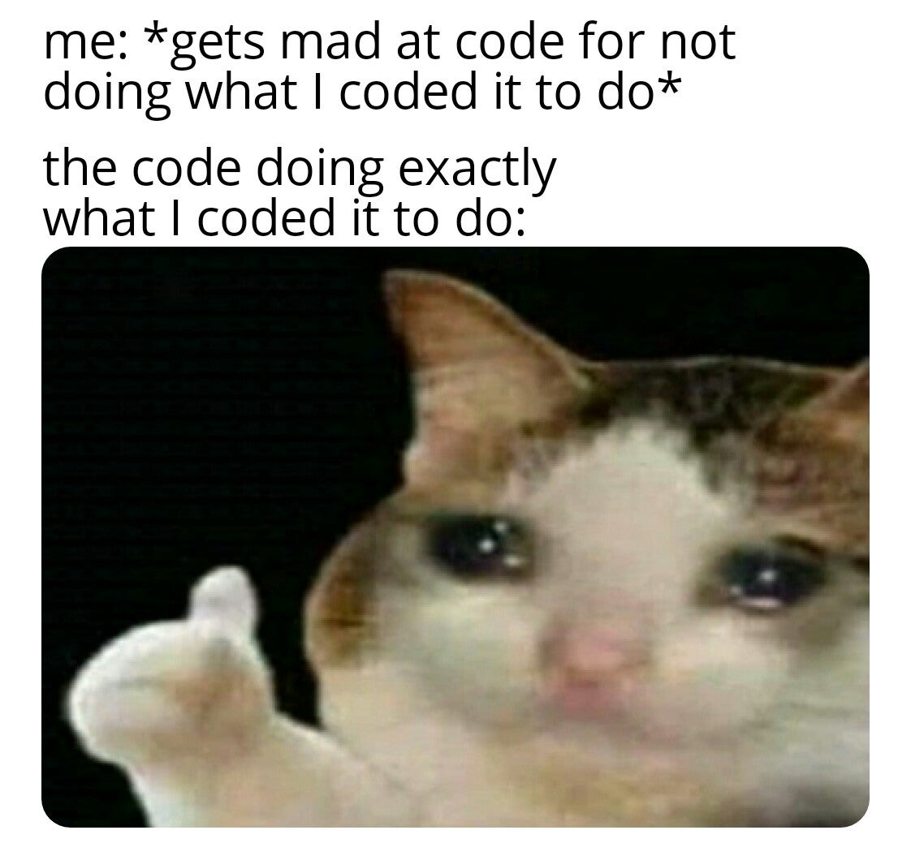

# Welcome to Creative Coding!
## DM-GY 6063 Creative Coding Section A

* **Term:** Fall 2020
* **Instructor:** Scott Fitzgerald
* **Instructor Email:** shf220@nyu.edu
* **Class meeting:** Wed 6:30pm – 9:20pm, 370 Jay Room 325 A
* **Office Hours:** [Tuesdays 2-4:30pm](https://calendar.google.com/calendar/selfsched?sstoken=UU5jZVJkYmh0Sk4yfGRlZmF1bHR8YThjZDQ3NjAxYjJlMDNhMWZiNTQ5OWJiYjRjMDMxYTQ)

_NB : This syllabus is subject to change_

## Contents
* [Pre-requisites](#pre-requisites)
* [Course Description](#course-description)
* [Program Objectives](#idm-program-objectives)
* [Learning outcomes](#learning-outcomes)
* [Important Dates](#important-dates)
* [Course structure](#course-structure)
* [Software](#software)
* [Hardware](#hardware)
* [Reading](#reading)
    * [Books](#books)
    * [Websites](#websites)
* [Grading & Attendance](#grading-and-attendance)
    * [Absences and tardiness](#Absences-and-tardiness)
    * [Grade Breakdown](#grade-breakdown)
    * [Midterm](#midterm)
    * [Final](#final)
    * [Assignments](#assignments)
    * [Online Journal](#online-journal)
* [Academic Accomodations](#academic-accomodations)

### Pre-requisites
None!

### Course Description
This course is an introductory programming class, appropriate for students with no prior programming experience. Traditionally, introductory programming teaches algorithmic problem-solving, where a sequence of instructions describe the steps necessary to achieve a desired result. In this course, students are trained to go beyond this sequential thinking – to think concurrently and modularly and ask questions about how computation cxan reflect creative potential. By semster end, students are empowered to write and read code for event-driven, object-oriented, experiences and connect them to the physical world.

### IDM Program objectives
Students will:
* Develop conceptual thinking skills to generate ideas and content in order to solve problems or create opportunities in art and design.
* Develop technical skills to realize their ideas.
* Develop critical thinking skills that will allow them to analyze and position their work within cultural, historic, aesthetic, economic, and technological contexts.
* Gain knowledge of professional practices and organizations by developing their verbal, visual, and written communication for documentation and presentation, exhibition and promotion, networking, and career preparation.
* Develop collaboration skills to actively and effectively work in a team or group.

### Learning outcomes
At the end of the course, students will :
* Understand the basics of creative coding in Javascript using p5.js.
* Write code within the context of visual art and design
* Apply their understanding of digital media to software.
* Learn best practices for designing software within an event-driven, object-oriented, real time framework.
* Propose and develop a complete software experience as a final project.

### Important Dates
* Wed September 2, Classes start
* Tuesday, September 15 last day of drop/add
* Monday, November 30 last day to withdraw with a W
* Thurs, November 26 - Friday, November 27 Thanksgiving break, no classes
* Sunday, December 13 last day of classes in semester

### Course structure
While we will be meeting weekly in class, technical lectures will be provided as online videos for you to go through at your own pace each week. You will have homework assignments based on these videos. We will spend time in class reinforcing the concepts that are covered, talk about how these relate to other topics, and conduct ourselves in a format that is conducive to conversation and group learning. Bringing your work to demonstrate and show is one part of this process, being open to critique, and willing to enagge other people abotu their work is another part. The success of this course depends quite a bit on your participation. 

There will be weekly readings to accoompany these videos, you should be prepared to discuss them in class. These will not be technical in nature. They are meant to provoke and excite you about the possibilities of using code as part of your practice.

### Software
* A code editor like [Brackets](http://brackets.io/), [Sublime Text](https://www.sublimetext.com/), [Atom](https://atom.io/) or similar. Some folks like [Visual Studio Code](https://code.visualstudio.com/?wt.mc_id=DX_841432), but its appeal is lost to me.
* The [Arduino IDE](https://www.arduino.cc/en/Main/Software)
* an account with the [p5.js online editor](https://editor.p5js.org/)

### Hardware
We'll be distributing equipment to you all soon.

### Reading
#### Books
There are no required books for class. Readings will be distributed as PDFs. 
Some relevant titles that you may want to look into include :
* [Generative Design 2nd ed by Benedikt Gross, Hartmut Bohnacker, Julia Laub, Claudius Lazzeroni](http://www.generative-gestaltung.de/2/)
* [Getting Started with p5js by Lauren McCarthy, Casey Reas, and Ben Fry](https://www.oreilly.com/library/view/make-getting-started/9781457186769/)
* [Getting Started with Arduino 3rd ed by Massimo Banzi and Michael Shiloh](https://www.oreilly.com/library/view/make-getting-started/9781449363321/)
* [Interaction of Color by Josef Albers](https://yalebooks.yale.edu/book/9780300179354/interaction-color)
* [Form+Code by Reas and McWilliams](http://formandcode.com/)

#### Websites
* [Arduino](http://arduino.cc)
* [p5js](http://p5js.org)
* [Processing](http://processing.org)
* [OpenProcessing](http://openprocessing.org)
* [Creative Applications](https://www.creativeapplications.net/)
* [r/CreativeCoding](https://www.reddit.com/r/creativecoding/)

### Grading and Attendance Policy
The assignments are designed to test and deepen your knowledge while giving me valuable information about how you’re progressing in the class. Remember, **finished is better than perfect**. An attempt at an assignment that does not meet your expectations is better than nothing at all.

You are expected to push yourself, be curious, and be challenged every week. If you have previous programming experience, this means you will be expected to “go beyond” the assignment, and interpret what a next step (or steps) would be for yourself. If you have no programming experience, that’s fine too! This course is made for you, and you should find yourself exploring means of creative expression that are novel to you.

Practice makes perfect. The more time you spend writing code and playing with these tools, the better versed you will be come in their possibilities. I suggest that instead of spending 8 hours the night before class trying to cram in everything, you spend time each day practicing programming.

Your in-class participation counts towards your grade. This means you are expected to be actively engaged in class discussions, attentive to other students, and mentally present in the classroom and on excursions. We will be having active discussions in class. If you are not naturally a talker, this is your chance to become one.

#### Absences and tardiness
Your attendance is important. Notify me of all absences prior to class. If you have one or two unexcused absence, each will impact your final grade by a third of a letter (ex. one unexcused absence will drop a final grade of A- to B+, two unexcused absences would drop that A- to a B). If you have three or more unexcused absences, you fail the course automatically.

If you’re more than 5 minutes late for class, you will be considered tardy. Two instances of tardiness = one unexcused absence.

#### Grade breakdown
* Weekly code assignments - 15%
* Reading responses - 10%
* Midterm - 20%
* Final - 35%
* Class participation - 20%

##### Midterm
Your midterm assignment is designed to demonstrate competency in the fundamentals of object oriented programming. We will discuss the specifics of this a few weeks before it is due. It will come in 2 parts in which you will make your own interactive, screen based artwork. Your sketch needs to contain at least 2 objects (they can be from the same class) that behave independently from one another. Taking into consideration responsiveness, accessibility, and aesthetics there should be some form of interaction for your audience. This could be through keypresses, mouse movements, GUI objects, etc.

##### Final
Your final project is wide open. This is your opportunity to create work that leverages the various tools, techniques and ideas we have explored throughout the semester. This includes interaction, data, design, computer vision, interfaces, games, or any number of alternative forms of expression. You should create work that is engaging and compelling for your audience. Use this as an excuse to ask a question using computation, or to scratch an itch you’ve always wanted to explore. We will spend several weeks at the end of the semester working through your ideas on these projects.

The sooner you start to think about and articulate your ideas for projects, the easier it will be for us to do any necessary course correction in the second half of the semester to address your interests.

##### Assignments
Each week you will be asked to write a software sketch (posssibly more than one) and post it online. You must also write a short blog post about the sketch, and react to any readings that are assigned. Blog posts are to be made on an online journal described below. Work is due before the next class meeting. We will spend time during each class going over the homework, so if you don’t understand a concept, its best to write about that, put up what you attempted to code, and we can use that as a starting point for class discussion.
Late work will be penalized. Every day work is overdue, it loses a letter grade. If work is turned in more than 4 days late, it receives an F. If you turn nothing in at all, you will receive a 0 for the assignment. Nobody wants that, so be sure to turn your work in on time. Anything is better than nothing.

##### Online Journal
You are expected to keep an online journal. The purpose of the journal is twofold. First, it is a valuable way for you to communicate to me that you are keeping up with the work in the class. I read the site to see how you are doing. At a minimum, reference to your work is expected, as well as reference to the readings, and thorough documentation of any research. Secondly, the journal is a way to document your work for your own use and that of others.

You must update the journal weekly with the work you have done for class. It's generally easiest to do this as you do the work.

Document your projects thoroughly as you go; don’t put it off until the end. Photos, video, drawings, schematics, and notes are all valuable forms of documentation. Explain the project at the beginning of your documentation, so that people who come to your site from outside this class can understand your work quickly.

Don’t overload your notes with code. Code repositories like gitHub are best for sharing code, rather than blogs, so post your code to a repository and link to it from your blog. When you base your code on someone else’s code, cite the original author and link to their code, just as you would when quoting another author in a paper. If you only changed one part of an existing program, post only the part you changed, and link to the original. Make sure any code you post is well-commented, so you and others can understand what it does. _Copying code or techniques without attribution is plagiarism._ Few ideas come out of the blue, and your readers can learn a lot from the sources from which you learned and by which you were were inspired. So be generous in sharing your sources.

Good documentation should include a description and illustration of your project. You should include what it looks like, what it does, what the user or participant does in response. When it’s interactive, mention and show what the user does. Your explanation should give enough information that someone who’s never seen the project can understand it.

You should also include a section describing how the project works, aimed at a more informed reader (your instructor, or next year’s classmates). Include a system diagram to make clear what the major components of the system are and how they communicate.

### Academic Accomodations
If you are student with a disability who is requesting accommodations, please contact New York University’s Moses Center for Students with Disabilities at 212-998-4980 or mosescsd@nyu.edu. You must be registered with CSD to receive accommodations. Information about the Moses Center can be found at http://www.nyu.edu/csd. The Moses Center is located at 726 Broadway on the 2nd floor.
